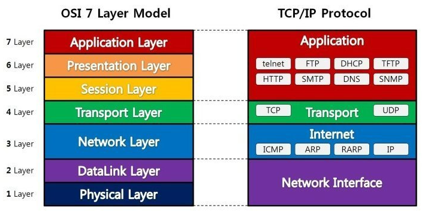

## OSI 7계층

> **OSI 7 계층은 네트워크에서 통신이 일어나는 과정을 7단계로 나눈 것을 말함**

### 1계층 - 물리계층(Physical Layer)

* 통신 단위는 비트(1과 0으로 나타내어지는 즉 on,off 상태)
* ex) 통신 케이블 , 리피터, 허브

 

### 2계층 - 데이터 링크계층(DataLink Layer)

* 정보의 전달을 수행
* MAC주소로 통신
* 브릿지, 스위치를 통해 MAC 주소를 가지고 물리계층에서 받은 정보를 전달
  * \*MAC = 물리적 주소

 

### 3계층 - 네트워크 계층(Network Layer)

* 데이터를 목적지까지 가장 안전하고 빠르게 전달하는 기능(라우팅)
* 경로를 선택하고 주소를 정하고 경로에 따라 패킷을 전달해주는 역할을 함
* 라우팅, 흐름 제어, 세그멘테이션(segmentation/desegmentation), 오류 제어, 인터네트워킹(Internetworking) 등을 수행
* 인터넷이 가능하게 만드는 계층

> **IP계층**  
\- IP 패킷의 전달 및 라우팅을 담당하는 계층

> **IP 프로토콜**  
\- IP 계층에서 IP 패킷의 라우팅 대상이 됨 (Routing)  
\- IP 주소 지정 (Addressing)

 

### 4계층 - 전송 계층(Transport Layer) 

* 통신을 활성화하기 위한 계층
* TCP/UDP프로토콜을 사용함
* 패킷 생성 및 전송

> **TCP 프로토콜**

* 신뢰성 있음 (Reliable)
* 연결지향적 (Connection-oriented)    

> **UDP 프로토콜**

* 비연결성이고, 신뢰성이 없으며, 순서화되지 않은 Datagram 서비스 제공 
* 실시간 응용 및 멀티캐스팅 가능
* 헤더가 단순함

 

### 5계층 -세션 계층(Session Layer) 

* 데이터가 통신하기 위한 논리적인 연결

 

### 6계층 - 표현 계층(Presentation Layer)

 

### 7계층 - 응용 계층(Application Layer)
